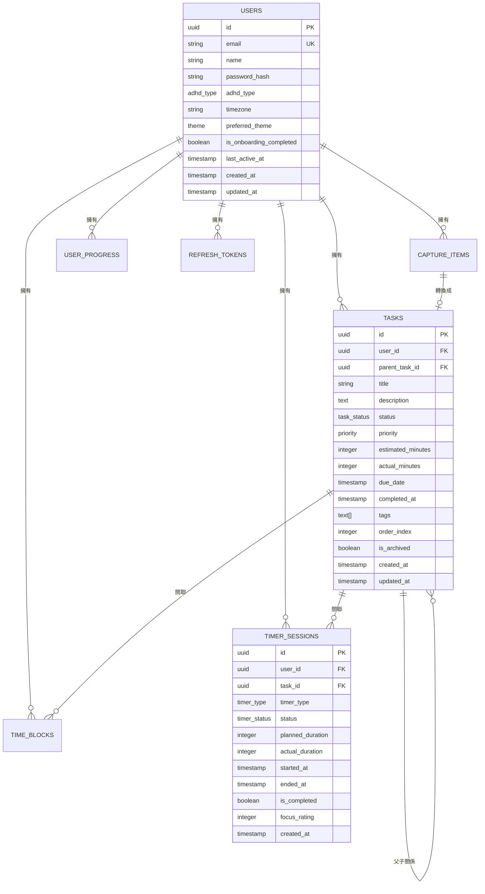

# ADHD 生產力系統 - 資料庫 Schema 文檔

## 📋 目錄
1. [概述](#概述)
2. [資料庫架構](#資料庫架構)
3. [資料表詳細說明](#資料表詳細說明)
4. [關聯圖](#關聯圖)
5. [索引策略](#索引策略)
6. [資料類型與枚舉](#資料類型與枚舉)
7. [約束與觸發器](#約束與觸發器)
8. [效能優化](#效能優化)
9. [資料遷移](#資料遷移)
10. [維護與備份](#維護與備份)

## 🎯 概述

ADHD 生產力系統使用 PostgreSQL 16 作為主要資料庫，採用關聯式資料庫設計模式，專門為 ADHD 使用者的需求優化。資料庫設計遵循正規化原則，同時考慮查詢效能和資料完整性。

### 設計原則
- **ADHD 中心化設計**：特別針對 ADHD 使用者的認知特性設計
- **時間序列優化**：大量的時間相關查詢優化
- **靈活性與擴展性**：支援未來功能擴展
- **資料完整性**：強制約束保證資料一致性
- **效能導向**：針對高頻查詢進行索引優化

## 🏗️ 資料庫架構

### 核心模組

```
ADHD 生產力系統資料庫架構:

┌─────────────────────────────────────────────────┐
│                   使用者模組                      │
│  ┌─────────────┬──────────────┬──────────────┐  │
│  │   Users     │ RefreshToken │ UserProgress │  │
│  └─────────────┴──────────────┴──────────────┘  │
└─────────────────┬───────────────────────────────┘
                  │
┌─────────────────┼─────────────────────────────────┐
│                任務管理模組                        │
│  ┌─────────────┬──────────────┬──────────────┐   │
│  │   Tasks     │ CaptureItems │  TimeBlocks  │   │
│  └─────────────┴──────────────┴──────────────┘   │
└─────────────────┬───────────────────────────────┘
                  │
┌─────────────────┼─────────────────────────────────┐
│               計時器模組                           │
│  ┌─────────────────────────────────────────────┐ │
│  │              TimerSessions                  │ │
│  └─────────────────────────────────────────────┘ │
└─────────────────────────────────────────────────┘
```

## 📊 資料表詳細說明

### 1. Users 表 (使用者)

儲存系統使用者的基本資訊和 ADHD 相關配置。

```sql
CREATE TABLE users (
    id UUID PRIMARY KEY DEFAULT uuid_generate_v4(),
    email VARCHAR(255) UNIQUE NOT NULL,
    name VARCHAR(255) NOT NULL,
    password_hash VARCHAR(255) NOT NULL,
    password_salt VARCHAR(255) NOT NULL,
    adhd_type adhd_type DEFAULT 'Combined',
    timezone VARCHAR(50) DEFAULT 'UTC',
    preferred_theme theme DEFAULT 'Light',
    is_onboarding_completed BOOLEAN DEFAULT false,
    last_active_at TIMESTAMP WITH TIME ZONE DEFAULT CURRENT_TIMESTAMP,
    profile_picture_url TEXT,
    created_at TIMESTAMP WITH TIME ZONE DEFAULT CURRENT_TIMESTAMP,
    updated_at TIMESTAMP WITH TIME ZONE DEFAULT CURRENT_TIMESTAMP
);
```

#### 欄位說明

| 欄位名稱 | 資料類型 | 約束 | 說明 |
|----------|----------|------|------|
| `id` | UUID | PK, NOT NULL | 使用者唯一識別碼 |
| `email` | VARCHAR(255) | UNIQUE, NOT NULL | 使用者電子郵件 (登入用) |
| `name` | VARCHAR(255) | NOT NULL | 使用者顯示名稱 |
| `password_hash` | VARCHAR(255) | NOT NULL | 密碼雜湊值 |
| `password_salt` | VARCHAR(255) | NOT NULL | 密碼鹽值 |
| `adhd_type` | ENUM | DEFAULT 'Combined' | ADHD 類型 |
| `timezone` | VARCHAR(50) | DEFAULT 'UTC' | 使用者時區 |
| `preferred_theme` | ENUM | DEFAULT 'Light' | 偏好主題 |
| `is_onboarding_completed` | BOOLEAN | DEFAULT false | 是否完成入門引導 |
| `last_active_at` | TIMESTAMP | DEFAULT NOW() | 最後活動時間 |
| `profile_picture_url` | TEXT | NULLABLE | 個人頭像 URL |

#### 業務規則
- 電子郵件必須唯一且格式有效
- 密碼必須符合安全性要求 (在應用層驗證)
- ADHD 類型用於個人化功能配置
- 時區用於正確顯示時間相關資訊

### 2. Tasks 表 (任務)

儲存使用者的任務資訊，支援階層式任務結構。

```sql
CREATE TABLE tasks (
    id UUID PRIMARY KEY DEFAULT uuid_generate_v4(),
    user_id UUID NOT NULL REFERENCES users(id) ON DELETE CASCADE,
    parent_task_id UUID REFERENCES tasks(id) ON DELETE CASCADE,
    title VARCHAR(500) NOT NULL,
    description TEXT,
    status task_status DEFAULT 'Todo',
    priority priority DEFAULT 'Medium',
    estimated_minutes INTEGER,
    actual_minutes INTEGER DEFAULT 0,
    due_date TIMESTAMP WITH TIME ZONE,
    completed_at TIMESTAMP WITH TIME ZONE,
    tags TEXT[],
    order_index INTEGER DEFAULT 0,
    is_archived BOOLEAN DEFAULT false,
    created_at TIMESTAMP WITH TIME ZONE DEFAULT CURRENT_TIMESTAMP,
    updated_at TIMESTAMP WITH TIME ZONE DEFAULT CURRENT_TIMESTAMP
);
```

#### 欄位說明

| 欄位名稱 | 資料類型 | 約束 | 說明 |
|----------|----------|------|------|
| `id` | UUID | PK, NOT NULL | 任務唯一識別碼 |
| `user_id` | UUID | FK, NOT NULL | 任務擁有者 |
| `parent_task_id` | UUID | FK, NULLABLE | 父任務 (支援子任務) |
| `title` | VARCHAR(500) | NOT NULL | 任務標題 |
| `description` | TEXT | NULLABLE | 任務詳細描述 |
| `status` | ENUM | DEFAULT 'Todo' | 任務狀態 |
| `priority` | ENUM | DEFAULT 'Medium' | 任務優先順序 |
| `estimated_minutes` | INTEGER | NULLABLE | 預估完成時間 (分鐘) |
| `actual_minutes` | INTEGER | DEFAULT 0 | 實際花費時間 (分鐘) |
| `due_date` | TIMESTAMP | NULLABLE | 截止日期 |
| `completed_at` | TIMESTAMP | NULLABLE | 完成時間 |
| `tags` | TEXT[] | NULLABLE | 標籤陣列 |
| `order_index` | INTEGER | DEFAULT 0 | 排序索引 |
| `is_archived` | BOOLEAN | DEFAULT false | 是否已封存 |

#### 業務規則
- 每個任務必須有擁有者
- 子任務的擁有者必須與父任務相同
- 完成任務時自動設定 `completed_at`
- 標籤用於分類和過濾
- `order_index` 用於自訂排序

### 3. CaptureItems 表 (快速捕獲)

儲存使用者快速捕獲的想法、任務或資訊。

```sql
CREATE TABLE capture_items (
    id UUID PRIMARY KEY DEFAULT uuid_generate_v4(),
    user_id UUID NOT NULL REFERENCES users(id) ON DELETE CASCADE,
    content TEXT NOT NULL,
    capture_type capture_type DEFAULT 'Quick',
    source VARCHAR(50) DEFAULT 'manual',
    is_processed BOOLEAN DEFAULT false,
    processed_at TIMESTAMP WITH TIME ZONE,
    converted_to_task_id UUID REFERENCES tasks(id) ON DELETE SET NULL,
    tags TEXT[],
    metadata JSONB,
    created_at TIMESTAMP WITH TIME ZONE DEFAULT CURRENT_TIMESTAMP
);
```

#### 欄位說明

| 欄位名稱 | 資料類型 | 約束 | 說明 |
|----------|----------|------|------|
| `id` | UUID | PK, NOT NULL | 捕獲項目唯一識別碼 |
| `user_id` | UUID | FK, NOT NULL | 項目擁有者 |
| `content` | TEXT | NOT NULL | 捕獲的內容 |
| `capture_type` | ENUM | DEFAULT 'Quick' | 捕獲類型 |
| `source` | VARCHAR(50) | DEFAULT 'manual' | 捕獲來源 |
| `is_processed` | BOOLEAN | DEFAULT false | 是否已處理 |
| `processed_at` | TIMESTAMP | NULLABLE | 處理時間 |
| `converted_to_task_id` | UUID | FK, NULLABLE | 轉換成的任務 ID |
| `tags` | TEXT[] | NULLABLE | 標籤陣列 |
| `metadata` | JSONB | NULLABLE | 額外元資料 |

#### 業務規則
- 內容不能為空
- 處理後不能再修改內容
- 可以轉換為正式任務
- 支援多種捕獲來源 (手動、API、電子郵件等)

### 4. TimerSessions 表 (計時器會話)

儲存使用者的專注計時會話資訊。

```sql
CREATE TABLE timer_sessions (
    id UUID PRIMARY KEY DEFAULT uuid_generate_v4(),
    user_id UUID NOT NULL REFERENCES users(id) ON DELETE CASCADE,
    task_id UUID REFERENCES tasks(id) ON DELETE SET NULL,
    timer_type timer_type DEFAULT 'Pomodoro',
    status timer_status DEFAULT 'Active',
    planned_duration INTEGER NOT NULL,
    actual_duration INTEGER,
    break_duration INTEGER DEFAULT 5,
    started_at TIMESTAMP WITH TIME ZONE NOT NULL,
    ended_at TIMESTAMP WITH TIME ZONE,
    paused_at TIMESTAMP WITH TIME ZONE,
    interruption_count INTEGER DEFAULT 0,
    is_completed BOOLEAN DEFAULT false,
    focus_rating INTEGER CHECK (focus_rating >= 1 AND focus_rating <= 10),
    notes TEXT,
    settings JSONB,
    created_at TIMESTAMP WITH TIME ZONE DEFAULT CURRENT_TIMESTAMP
);
```

#### 欄位說明

| 欄位名稱 | 資料類型 | 約束 | 說明 |
|----------|----------|------|------|
| `id` | UUID | PK, NOT NULL | 會話唯一識別碼 |
| `user_id` | UUID | FK, NOT NULL | 會話擁有者 |
| `task_id` | UUID | FK, NULLABLE | 關聯的任務 |
| `timer_type` | ENUM | DEFAULT 'Pomodoro' | 計時器類型 |
| `status` | ENUM | DEFAULT 'Active' | 會話狀態 |
| `planned_duration` | INTEGER | NOT NULL | 計劃時長 (分鐘) |
| `actual_duration` | INTEGER | NULLABLE | 實際時長 (分鐘) |
| `break_duration` | INTEGER | DEFAULT 5 | 休息時長 (分鐘) |
| `started_at` | TIMESTAMP | NOT NULL | 開始時間 |
| `ended_at` | TIMESTAMP | NULLABLE | 結束時間 |
| `paused_at` | TIMESTAMP | NULLABLE | 暫停時間 |
| `interruption_count` | INTEGER | DEFAULT 0 | 中斷次數 |
| `is_completed` | BOOLEAN | DEFAULT false | 是否完成 |
| `focus_rating` | INTEGER | CHECK 1-10 | 專注度評分 |
| `notes` | TEXT | NULLABLE | 會話筆記 |
| `settings` | JSONB | NULLABLE | 會話設定 |

#### 業務規則
- 每個會話必須有開始時間
- 實際時長在會話結束時計算
- 中斷次數影響專注度分析
- 設定包含背景音樂、提醒偏好等

### 5. TimeBlocks 表 (時間區塊)

儲存使用者的時間規劃和日程安排。

```sql
CREATE TABLE time_blocks (
    id UUID PRIMARY KEY DEFAULT uuid_generate_v4(),
    user_id UUID NOT NULL REFERENCES users(id) ON DELETE CASCADE,
    task_id UUID REFERENCES tasks(id) ON DELETE SET NULL,
    title VARCHAR(255) NOT NULL,
    description TEXT,
    block_type time_block_type DEFAULT 'Work',
    start_time TIMESTAMP WITH TIME ZONE NOT NULL,
    end_time TIMESTAMP WITH TIME ZONE NOT NULL,
    is_flexible BOOLEAN DEFAULT false,
    color VARCHAR(7) DEFAULT '#3B82F6',
    location VARCHAR(255),
    attendees TEXT[],
    reminders INTEGER[] DEFAULT '{15}',
    recurrence_rule TEXT,
    created_at TIMESTAMP WITH TIME ZONE DEFAULT CURRENT_TIMESTAMP,
    updated_at TIMESTAMP WITH TIME ZONE DEFAULT CURRENT_TIMESTAMP,
    CONSTRAINT valid_time_range CHECK (end_time > start_time)
);
```

#### 欄位說明

| 欄位名稱 | 資料類型 | 約束 | 說明 |
|----------|----------|------|------|
| `id` | UUID | PK, NOT NULL | 時間區塊唯一識別碼 |
| `user_id` | UUID | FK, NOT NULL | 區塊擁有者 |
| `task_id` | UUID | FK, NULLABLE | 關聯的任務 |
| `title` | VARCHAR(255) | NOT NULL | 區塊標題 |
| `description` | TEXT | NULLABLE | 區塊描述 |
| `block_type` | ENUM | DEFAULT 'Work' | 區塊類型 |
| `start_time` | TIMESTAMP | NOT NULL | 開始時間 |
| `end_time` | TIMESTAMP | NOT NULL | 結束時間 |
| `is_flexible` | BOOLEAN | DEFAULT false | 是否彈性時間 |
| `color` | VARCHAR(7) | DEFAULT '#3B82F6' | 顯示顏色 |
| `location` | VARCHAR(255) | NULLABLE | 地點 |
| `attendees` | TEXT[] | NULLABLE | 參與者 |
| `reminders` | INTEGER[] | DEFAULT '{15}' | 提醒時間 (分鐘) |
| `recurrence_rule` | TEXT | NULLABLE | 重複規則 (RRULE) |

#### 業務規則
- 結束時間必須晚於開始時間
- 彈性時間可以在衝突時調整
- 顏色用十六進位格式
- 重複規則遵循 RFC 5545 標準

### 6. UserProgress 表 (使用者進度)

追蹤使用者的日常進度和統計資訊。

```sql
CREATE TABLE user_progress (
    id UUID PRIMARY KEY DEFAULT uuid_generate_v4(),
    user_id UUID NOT NULL REFERENCES users(id) ON DELETE CASCADE,
    date DATE NOT NULL,
    tasks_completed INTEGER DEFAULT 0,
    tasks_created INTEGER DEFAULT 0,
    total_focus_minutes INTEGER DEFAULT 0,
    pomodoro_sessions INTEGER DEFAULT 0,
    break_sessions INTEGER DEFAULT 0,
    interruption_count INTEGER DEFAULT 0,
    energy_level energy_level,
    mood_rating INTEGER CHECK (mood_rating >= 1 AND mood_rating <= 10),
    productivity_rating INTEGER CHECK (productivity_rating >= 1 AND productivity_rating <= 10),
    stress_level INTEGER CHECK (stress_level >= 1 AND stress_level <= 10),
    sleep_hours DECIMAL(3,1),
    medication_taken BOOLEAN,
    notes TEXT,
    goals_achieved INTEGER DEFAULT 0,
    goals_total INTEGER DEFAULT 0,
    created_at TIMESTAMP WITH TIME ZONE DEFAULT CURRENT_TIMESTAMP,
    updated_at TIMESTAMP WITH TIME ZONE DEFAULT CURRENT_TIMESTAMP,
    UNIQUE(user_id, date)
);
```

#### 欄位說明

| 欄位名稱 | 資料類型 | 約束 | 說明 |
|----------|----------|------|------|
| `id` | UUID | PK, NOT NULL | 進度記錄唯一識別碼 |
| `user_id` | UUID | FK, NOT NULL | 使用者 |
| `date` | DATE | NOT NULL | 記錄日期 |
| `tasks_completed` | INTEGER | DEFAULT 0 | 完成任務數 |
| `tasks_created` | INTEGER | DEFAULT 0 | 建立任務數 |
| `total_focus_minutes` | INTEGER | DEFAULT 0 | 總專注時間 |
| `pomodoro_sessions` | INTEGER | DEFAULT 0 | 番茄鐘會話數 |
| `break_sessions` | INTEGER | DEFAULT 0 | 休息會話數 |
| `interruption_count` | INTEGER | DEFAULT 0 | 中斷次數 |
| `energy_level` | ENUM | NULLABLE | 能量水平 |
| `mood_rating` | INTEGER | CHECK 1-10 | 心情評分 |
| `productivity_rating` | INTEGER | CHECK 1-10 | 生產力評分 |
| `stress_level` | INTEGER | CHECK 1-10 | 壓力水平 |
| `sleep_hours` | DECIMAL(3,1) | NULLABLE | 睡眠時數 |
| `medication_taken` | BOOLEAN | NULLABLE | 是否服藥 |
| `notes` | TEXT | NULLABLE | 日記筆記 |
| `goals_achieved` | INTEGER | DEFAULT 0 | 達成目標數 |
| `goals_total` | INTEGER | DEFAULT 0 | 總目標數 |

#### 業務規則
- 每個使用者每天只能有一筆記錄
- 評分必須在 1-10 範圍內
- 自動統計當日的任務和會話資料
- 用於生成趨勢分析和洞察

### 7. RefreshTokens 表 (刷新令牌)

儲存使用者的刷新令牌，用於身份驗證。

```sql
CREATE TABLE refresh_tokens (
    id UUID PRIMARY KEY DEFAULT uuid_generate_v4(),
    user_id UUID NOT NULL REFERENCES users(id) ON DELETE CASCADE,
    token VARCHAR(500) UNIQUE NOT NULL,
    expires_at TIMESTAMP WITH TIME ZONE NOT NULL,
    created_at TIMESTAMP WITH TIME ZONE DEFAULT CURRENT_TIMESTAMP,
    revoked_at TIMESTAMP WITH TIME ZONE,
    is_revoked BOOLEAN DEFAULT false,
    device_info TEXT,
    ip_address INET
);
```

#### 欄位說明

| 欄位名稱 | 資料類型 | 約束 | 說明 |
|----------|----------|------|------|
| `id` | UUID | PK, NOT NULL | 令牌唯一識別碼 |
| `user_id` | UUID | FK, NOT NULL | 令牌擁有者 |
| `token` | VARCHAR(500) | UNIQUE, NOT NULL | 刷新令牌值 |
| `expires_at` | TIMESTAMP | NOT NULL | 過期時間 |
| `created_at` | TIMESTAMP | DEFAULT NOW() | 建立時間 |
| `revoked_at` | TIMESTAMP | NULLABLE | 撤銷時間 |
| `is_revoked` | BOOLEAN | DEFAULT false | 是否已撤銷 |
| `device_info` | TEXT | NULLABLE | 裝置資訊 |
| `ip_address` | INET | NULLABLE | IP 地址 |

#### 業務規則
- 令牌值必須唯一且安全
- 過期令牌自動無效
- 支援多裝置登入
- 記錄裝置和 IP 用於安全審計

## 🔗 關聯圖



## 📈 索引策略

### 主要索引

```sql
-- Users 表索引
CREATE UNIQUE INDEX idx_users_email ON users(email);
CREATE INDEX idx_users_adhd_type ON users(adhd_type);
CREATE INDEX idx_users_last_active ON users(last_active_at);

-- Tasks 表索引
CREATE INDEX idx_tasks_user_id ON tasks(user_id);
CREATE INDEX idx_tasks_status ON tasks(status);
CREATE INDEX idx_tasks_priority ON tasks(priority);
CREATE INDEX idx_tasks_due_date ON tasks(due_date) WHERE due_date IS NOT NULL;
CREATE INDEX idx_tasks_parent_id ON tasks(parent_task_id) WHERE parent_task_id IS NOT NULL;
CREATE INDEX idx_tasks_tags ON tasks USING GIN(tags);
CREATE INDEX idx_tasks_user_status ON tasks(user_id, status);
CREATE INDEX idx_tasks_user_priority ON tasks(user_id, priority);

-- CaptureItems 表索引
CREATE INDEX idx_capture_items_user_id ON capture_items(user_id);
CREATE INDEX idx_capture_items_processed ON capture_items(is_processed);
CREATE INDEX idx_capture_items_created_at ON capture_items(created_at);
CREATE INDEX idx_capture_items_tags ON capture_items USING GIN(tags);

-- TimerSessions 表索引
CREATE INDEX idx_timer_sessions_user_id ON timer_sessions(user_id);
CREATE INDEX idx_timer_sessions_task_id ON timer_sessions(task_id) WHERE task_id IS NOT NULL;
CREATE INDEX idx_timer_sessions_started_at ON timer_sessions(started_at);
CREATE INDEX idx_timer_sessions_status ON timer_sessions(status);
CREATE INDEX idx_timer_sessions_user_date ON timer_sessions(user_id, started_at);

-- TimeBlocks 表索引
CREATE INDEX idx_time_blocks_user_id ON time_blocks(user_id);
CREATE INDEX idx_time_blocks_time_range ON time_blocks(start_time, end_time);
CREATE INDEX idx_time_blocks_task_id ON time_blocks(task_id) WHERE task_id IS NOT NULL;

-- UserProgress 表索引
CREATE UNIQUE INDEX idx_user_progress_user_date ON user_progress(user_id, date);
CREATE INDEX idx_user_progress_date ON user_progress(date);

-- RefreshTokens 表索引
CREATE UNIQUE INDEX idx_refresh_tokens_token ON refresh_tokens(token);
CREATE INDEX idx_refresh_tokens_user_id ON refresh_tokens(user_id);
CREATE INDEX idx_refresh_tokens_expires_at ON refresh_tokens(expires_at);
```

### 複合索引說明

- **user_status**: 優化按使用者和狀態查詢任務
- **user_priority**: 優化按使用者和優先順序查詢
- **user_date**: 優化按使用者和日期查詢會話
- **time_range**: 優化時間區間重疊查詢

## 🏷️ 資料類型與枚舉

### 自定義枚舉類型

```sql
-- ADHD 類型
CREATE TYPE adhd_type AS ENUM (
    'Inattentive',     -- 注意力不足型
    'Hyperactive',     -- 過動型
    'Combined'         -- 混合型
);

-- 任務狀態
CREATE TYPE task_status AS ENUM (
    'Todo',           -- 待辦
    'InProgress',     -- 進行中
    'Completed',      -- 已完成
    'OnHold',         -- 暫停
    'Cancelled',      -- 已取消
    'Waiting'         -- 等待中
);

-- 優先順序
CREATE TYPE priority AS ENUM (
    'Low',            -- 低
    'Medium',         -- 中
    'High',           -- 高
    'Critical'        -- 緊急
);

-- 能量水平
CREATE TYPE energy_level AS ENUM (
    'High',           -- 高能量
    'Medium',         -- 中等能量
    'Low',            -- 低能量
    'Depleted'        -- 能量耗盡
);

-- 主題
CREATE TYPE theme AS ENUM (
    'Light',          -- 亮色主題
    'Dark',           -- 暗色主題
    'Auto',           -- 自動
    'HighContrast'    -- 高對比
);

-- 捕獲類型
CREATE TYPE capture_type AS ENUM (
    'Quick',          -- 快速捕獲
    'Detailed',       -- 詳細捕獲
    'Voice',          -- 語音捕獲
    'Email',          -- 電子郵件
    'Web'             -- 網頁剪藏
);

-- 計時器類型
CREATE TYPE timer_type AS ENUM (
    'Pomodoro',       -- 番茄鐘
    'Focus',          -- 專注計時
    'Break',          -- 休息計時
    'Custom'          -- 自訂計時
);

-- 計時器狀態
CREATE TYPE timer_status AS ENUM (
    'Active',         -- 活動中
    'Paused',         -- 暫停
    'Completed',      -- 完成
    'Interrupted',    -- 中斷
    'Cancelled'       -- 取消
);

-- 時間區塊類型
CREATE TYPE time_block_type AS ENUM (
    'Work',           -- 工作
    'Break',          -- 休息
    'Meeting',        -- 會議
    'Personal',       -- 個人
    'Exercise',       -- 運動
    'Meal',           -- 用餐
    'Travel'          -- 通勤
);
```

## ⚙️ 約束與觸發器

### 檢查約束

```sql
-- 評分範圍約束
ALTER TABLE user_progress 
ADD CONSTRAINT check_mood_rating 
CHECK (mood_rating >= 1 AND mood_rating <= 10);

ALTER TABLE user_progress 
ADD CONSTRAINT check_productivity_rating 
CHECK (productivity_rating >= 1 AND productivity_rating <= 10);

ALTER TABLE user_progress 
ADD CONSTRAINT check_stress_level 
CHECK (stress_level >= 1 AND stress_level <= 10);

-- 時間邏輯約束
ALTER TABLE time_blocks 
ADD CONSTRAINT check_valid_time_range 
CHECK (end_time > start_time);

ALTER TABLE timer_sessions 
ADD CONSTRAINT check_positive_duration 
CHECK (planned_duration > 0);

-- 睡眠時數約束
ALTER TABLE user_progress 
ADD CONSTRAINT check_sleep_hours 
CHECK (sleep_hours >= 0 AND sleep_hours <= 24);
```

### 觸發器函數

```sql
-- 更新 updated_at 欄位的通用函數
CREATE OR REPLACE FUNCTION update_updated_at_column()
RETURNS TRIGGER AS $$
BEGIN
    NEW.updated_at = CURRENT_TIMESTAMP;
    RETURN NEW;
END;
$$ language 'plpgsql';

-- 應用觸發器
CREATE TRIGGER update_users_updated_at 
    BEFORE UPDATE ON users
    FOR EACH ROW 
    EXECUTE FUNCTION update_updated_at_column();

CREATE TRIGGER update_tasks_updated_at 
    BEFORE UPDATE ON tasks
    FOR EACH ROW 
    EXECUTE FUNCTION update_updated_at_column();

CREATE TRIGGER update_time_blocks_updated_at 
    BEFORE UPDATE ON time_blocks
    FOR EACH ROW 
    EXECUTE FUNCTION update_updated_at_column();

CREATE TRIGGER update_user_progress_updated_at 
    BEFORE UPDATE ON user_progress
    FOR EACH ROW 
    EXECUTE FUNCTION update_updated_at_column();
```

### 自動統計觸發器

```sql
-- 自動更新使用者進度統計
CREATE OR REPLACE FUNCTION update_user_progress_stats()
RETURNS TRIGGER AS $$
DECLARE
    progress_date DATE;
    user_uuid UUID;
BEGIN
    -- 判斷操作類型
    IF TG_OP = 'DELETE' THEN
        progress_date := OLD.completed_at::date;
        user_uuid := OLD.user_id;
    ELSE
        progress_date := NEW.completed_at::date;
        user_uuid := NEW.user_id;
    END IF;
    
    -- 更新當日統計
    INSERT INTO user_progress (user_id, date, tasks_completed)
    VALUES (user_uuid, progress_date, 
            (SELECT COUNT(*) FROM tasks 
             WHERE user_id = user_uuid 
             AND completed_at::date = progress_date
             AND status = 'Completed'))
    ON CONFLICT (user_id, date) 
    DO UPDATE SET 
        tasks_completed = EXCLUDED.tasks_completed,
        updated_at = CURRENT_TIMESTAMP;
    
    RETURN COALESCE(NEW, OLD);
END;
$$ LANGUAGE plpgsql;

-- 建立觸發器
CREATE TRIGGER task_completion_stats_trigger
    AFTER UPDATE OF status ON tasks
    FOR EACH ROW
    WHEN (NEW.status = 'Completed' AND OLD.status != 'Completed')
    EXECUTE FUNCTION update_user_progress_stats();
```

## 🚀 效能優化

### 查詢優化策略

#### 1. 分區策略

```sql
-- 為大表建立分區 (以 user_progress 為例)
CREATE TABLE user_progress_y2024 PARTITION OF user_progress
FOR VALUES FROM ('2024-01-01') TO ('2025-01-01');

CREATE TABLE user_progress_y2025 PARTITION OF user_progress
FOR VALUES FROM ('2025-01-01') TO ('2026-01-01');
```

#### 2. 物化視圖

```sql
-- 使用者每週統計物化視圖
CREATE MATERIALIZED VIEW user_weekly_stats AS
SELECT 
    user_id,
    date_trunc('week', date) AS week_start,
    SUM(tasks_completed) AS total_tasks_completed,
    SUM(total_focus_minutes) AS total_focus_minutes,
    AVG(productivity_rating) AS avg_productivity_rating,
    AVG(mood_rating) AS avg_mood_rating
FROM user_progress
GROUP BY user_id, date_trunc('week', date);

-- 建立索引
CREATE UNIQUE INDEX idx_user_weekly_stats_user_week 
ON user_weekly_stats(user_id, week_start);

-- 定期刷新
CREATE OR REPLACE FUNCTION refresh_weekly_stats()
RETURNS void AS $$
BEGIN
    REFRESH MATERIALIZED VIEW CONCURRENTLY user_weekly_stats;
END;
$$ LANGUAGE plpgsql;
```

#### 3. 常用查詢優化

```sql
-- 取得使用者今日任務 (優化版)
EXPLAIN ANALYZE
SELECT t.id, t.title, t.status, t.priority, t.due_date
FROM tasks t
WHERE t.user_id = $1
  AND t.is_archived = false
  AND (t.due_date IS NULL OR t.due_date >= CURRENT_DATE)
ORDER BY 
  CASE t.priority 
    WHEN 'Critical' THEN 1
    WHEN 'High' THEN 2
    WHEN 'Medium' THEN 3
    WHEN 'Low' THEN 4
  END,
  t.due_date NULLS LAST,
  t.created_at DESC;

-- 取得使用者本週進度統計
SELECT 
    DATE(generate_series(
        date_trunc('week', CURRENT_DATE),
        date_trunc('week', CURRENT_DATE) + interval '6 days',
        interval '1 day'
    )) AS date,
    COALESCE(up.tasks_completed, 0) AS tasks_completed,
    COALESCE(up.total_focus_minutes, 0) AS focus_minutes
FROM generate_series(
    date_trunc('week', CURRENT_DATE),
    date_trunc('week', CURRENT_DATE) + interval '6 days',
    interval '1 day'
) AS dates
LEFT JOIN user_progress up ON up.user_id = $1 AND up.date = dates::date
ORDER BY date;
```

### 連接池配置

```ini
# PostgreSQL 配置優化
max_connections = 200
shared_buffers = 256MB
effective_cache_size = 1GB
work_mem = 16MB
maintenance_work_mem = 256MB
checkpoint_completion_target = 0.7
wal_buffers = 16MB
default_statistics_target = 100
random_page_cost = 1.1
effective_io_concurrency = 200
```

## 🔄 資料遷移

### 版本管理策略

```sql
-- 版本追蹤表
CREATE TABLE schema_migrations (
    version VARCHAR(255) PRIMARY KEY,
    applied_at TIMESTAMP WITH TIME ZONE DEFAULT CURRENT_TIMESTAMP,
    description TEXT
);

-- 範例遷移腳本結構
-- migrations/001_initial_schema.sql
-- migrations/002_add_user_preferences.sql
-- migrations/003_add_timer_sessions_improvements.sql
```

### 遷移腳本範例

```sql
-- migrations/002_add_user_preferences.sql
BEGIN;

-- 新增使用者偏好設定表
CREATE TABLE user_preferences (
    id UUID PRIMARY KEY DEFAULT uuid_generate_v4(),
    user_id UUID NOT NULL REFERENCES users(id) ON DELETE CASCADE,
    notification_enabled BOOLEAN DEFAULT true,
    daily_goal_tasks INTEGER DEFAULT 5,
    default_pomodoro_duration INTEGER DEFAULT 25,
    default_break_duration INTEGER DEFAULT 5,
    work_hours_start TIME DEFAULT '09:00',
    work_hours_end TIME DEFAULT '17:00',
    created_at TIMESTAMP WITH TIME ZONE DEFAULT CURRENT_TIMESTAMP,
    updated_at TIMESTAMP WITH TIME ZONE DEFAULT CURRENT_TIMESTAMP,
    UNIQUE(user_id)
);

-- 為現有使用者建立預設偏好設定
INSERT INTO user_preferences (user_id)
SELECT id FROM users;

-- 記錄遷移
INSERT INTO schema_migrations (version, description)
VALUES ('002', 'Add user preferences table');

COMMIT;
```

### 回滾策略

```sql
-- migrations/002_add_user_preferences_rollback.sql
BEGIN;

-- 移除表格
DROP TABLE IF EXISTS user_preferences;

-- 移除遷移記錄
DELETE FROM schema_migrations WHERE version = '002';

COMMIT;
```

## 🛠️ 維護與備份

### 定期維護腳本

```sql
-- 清理過期的刷新令牌
DELETE FROM refresh_tokens 
WHERE expires_at < CURRENT_TIMESTAMP - INTERVAL '7 days';

-- 更新統計資訊
ANALYZE;

-- 重建索引 (必要時)
REINDEX DATABASE adhd_productivity;

-- 清理舊的進度記錄 (保留 2 年)
DELETE FROM user_progress 
WHERE date < CURRENT_DATE - INTERVAL '2 years';
```

### 備份策略

```bash
#!/bin/bash
# 每日備份腳本

DATE=$(date +%Y%m%d_%H%M%S)
BACKUP_DIR="/backup"
DB_NAME="adhd_productivity"

# 完整備份
pg_dump -h localhost -U adhd_user -d $DB_NAME \
  --format=custom \
  --compress=9 \
  --file="$BACKUP_DIR/full_backup_$DATE.dump"

# Schema 備份
pg_dump -h localhost -U adhd_user -d $DB_NAME \
  --schema-only \
  --file="$BACKUP_DIR/schema_backup_$DATE.sql"

# 清理舊備份 (保留 30 天)
find $BACKUP_DIR -name "*.dump" -mtime +30 -delete
find $BACKUP_DIR -name "*.sql" -mtime +30 -delete
```

### 監控查詢

```sql
-- 查看資料庫大小
SELECT 
    pg_size_pretty(pg_database_size('adhd_productivity')) AS database_size;

-- 查看各表大小
SELECT 
    schemaname,
    tablename,
    pg_size_pretty(pg_total_relation_size(schemaname||'.'||tablename)) AS size
FROM pg_tables 
WHERE schemaname = 'public'
ORDER BY pg_total_relation_size(schemaname||'.'||tablename) DESC;

-- 查看索引使用情況
SELECT 
    schemaname,
    tablename,
    indexname,
    idx_scan,
    idx_tup_read,
    idx_tup_fetch
FROM pg_stat_user_indexes
ORDER BY idx_scan DESC;

-- 查看慢查詢
SELECT 
    query,
    calls,
    total_time,
    mean_time,
    rows
FROM pg_stat_statements
ORDER BY mean_time DESC
LIMIT 10;
```

---

**版本**: 1.0.0  
**最後更新**: 2024年12月22日  
**維護者**: ADHD 生產力系統開發團隊